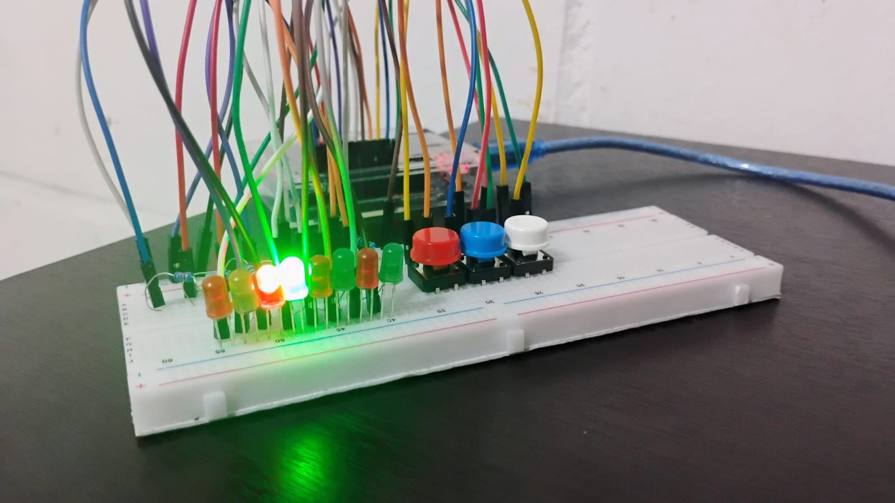

# Secuenciador LED Arduino (3 Velocidades)

Este proyecto implementa un efecto de "luz corrediza" o secuenciador utilizando 8 LEDs y un Arduino Uno (o compatible). La velocidad de la secuencia puede ser controlada en tiempo real mediante tres botones: uno para velocidad lenta, uno para velocidad media y otro para velocidad rápida.

## Funcionalidad

*   Al encender, el secuenciador comienza a una velocidad media por defecto.
*   Un LED se enciende a la vez, creando un efecto visual de luz que se desplaza a través de la fila de LEDs.
*   Al presionar el **botón rojo**, la secuencia cambia a **velocidad lenta**.
*   Al presionar el **botón azul**, la secuencia cambia (o vuelve) a **velocidad media**.
*   Al presionar el **botón blanco**, la secuencia cambia a **velocidad rápida**.
*   El programa utiliza `millis()` para el control del tiempo, permitiendo que la lectura de los botones sea responsiva incluso mientras la secuencia LED está activa.

## Componentes Utilizados

*   1 x Arduino Uno R3 (o clon compatible)
*   1 x Protoboard (Placa de pruebas sin soldadura)
*   8 x LEDs (En el ejemplo se usan 4 rojos y 4 verdes, pero cualquier color funciona)
*   8 x Resistencias de 1kΩ (para proteger los LEDs)
*   3 x Botones Pulsadores Táctiles (Tactile Push Buttons)
*   Cables Jumper (Macho-Macho)
*   1 x Cable USB (para programar y alimentar el Arduino)

## Conexiones / Cableado

Es crucial conectar correctamente todos los componentes. Asegúrate de tener una conexión común a **GND (Tierra)**.

### LEDs:

Cada LED se conecta de la siguiente manera:
1.  La pata **larga** (ánodo) del LED se conecta a un extremo de una resistencia (1kΩ).
2.  El otro extremo de la resistencia se conecta a un pin digital del Arduino.
3.  La pata **corta** (cátodo) del LED se conecta al riel **GND (-)** de la protoboard.

*   LED 1 -> Resistencia -> Pin Digital **2**
*   LED 2 -> Resistencia -> Pin Digital **3**
*   LED 3 -> Resistencia -> Pin Digital **4**
*   LED 4 -> Resistencia -> Pin Digital **5**
*   LED 5 -> Resistencia -> Pin Digital **6**
*   LED 6 -> Resistencia -> Pin Digital **7**
*   LED 7 -> Resistencia -> Pin Digital **8**
*   LED 8 -> Resistencia -> Pin Digital **9**

### Botones:

Los botones se conectan usando la resistencia pull-up interna del Arduino (`INPUT_PULLUP`). **No necesitas resistencias externas para los botones.**
1.  Una pata del botón se conecta a un pin digital del Arduino.
2.  La pata opuesta (diagonalmente o en el lado largo opuesto, dependiendo del botón) se conecta al riel **GND (-)** de la protoboard.

*   Botón Rojo (Lento) -> Pin Digital **10** | Otra pata -> **GND**
*   Botón Azul (Medio) -> Pin Digital **11** | Otra pata -> **GND**
*   Botón Blanco (Rápido) -> Pin Digital **12** | Otra pata -> **GND**

### Conexión GND Común:

*   Conecta un cable desde uno de los pines **GND** del Arduino al **riel azul (-) (GND)** de la protoboard. Asegúrate de que todos los cátodos de los LEDs y una pata de cada botón estén conectados a este mismo riel GND.
*   **Importante:** Si tu protoboard es larga, los rieles de alimentación pueden tener una interrupción en el medio. Si es así, usa un cable jumper para puentear la interrupción en el riel GND (-) y asegurar que todos los componentes tengan conexión a tierra.

## Código

El código fuente (`.ino`) se encuentra en este repositorio. Utiliza las funciones `digitalWrite()` para controlar los LEDs, `digitalRead()` con `INPUT_PULLUP` para leer los botones y `millis()` para manejar los tiempos sin bloquear el programa.

### Para usarlo:

1.  Abre el archivo `.ino` con el Arduino IDE.
2.  Conecta tu Arduino al ordenador mediante USB.
3.  Selecciona la placa "Arduino Uno" y el puerto COM correcto en el menú "Herramientas".
4.  Haz clic en el botón "Subir" (Upload).
5.  Una vez subido, el circuito debería empezar a funcionar con la secuencia a velocidad media. Prueba los botones para cambiar la velocidad.

